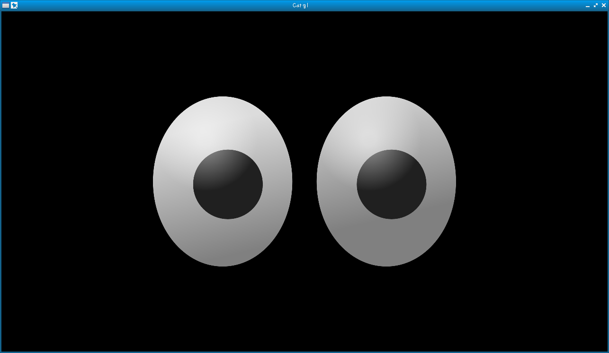
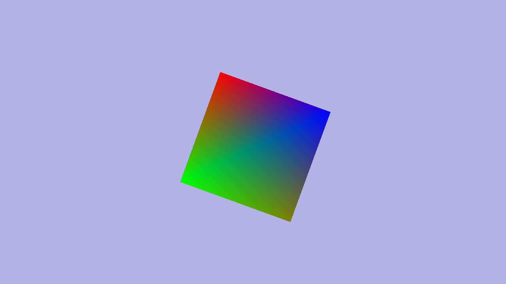
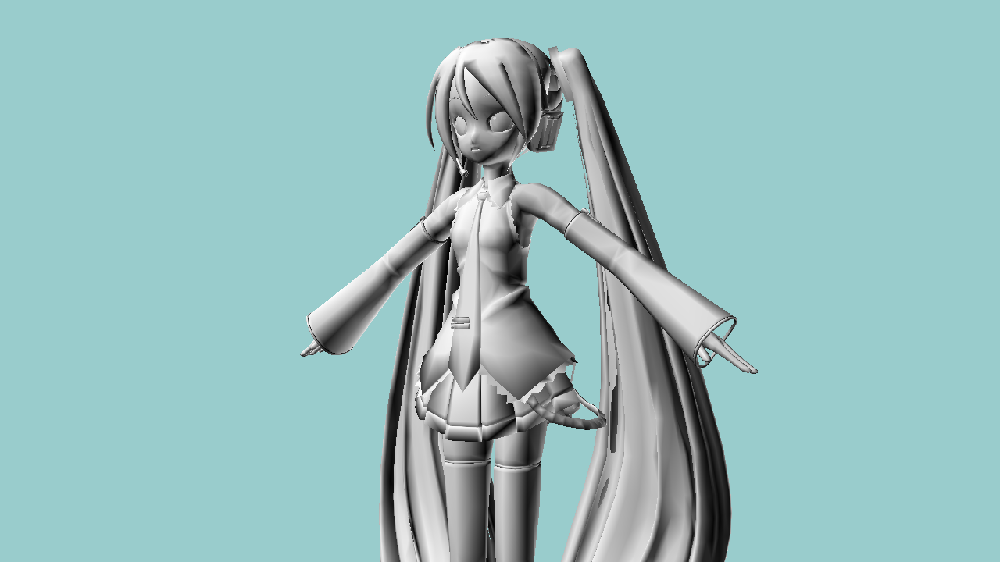
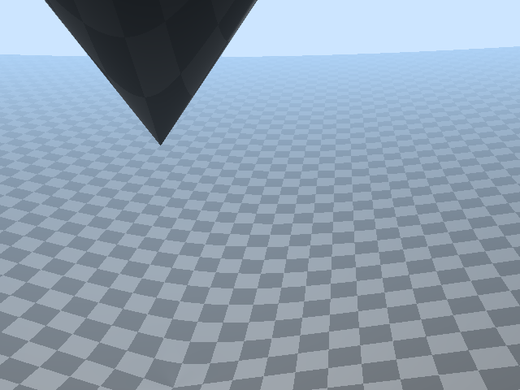
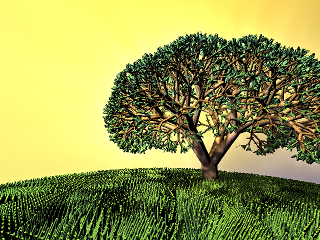
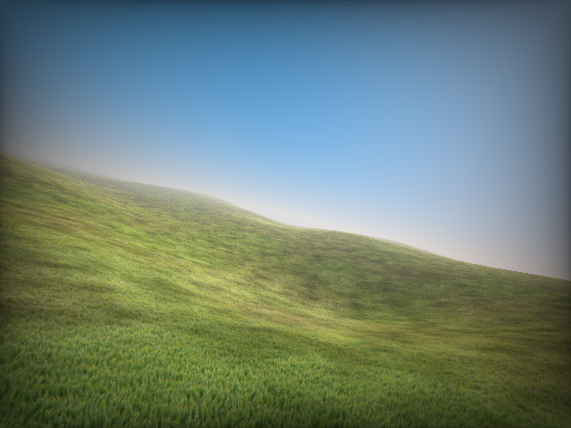

# catgl

Catgl is a cross-platform 3D graphics engine intended to be easy-to-use and high performance, which also supports the features for game development, such as animation, input device handling and sound playing.
This application is designed for Android, iOS, Linux, Windows.

## Technologies

- OpenGL / OpenGLES
- GLSL (OpenGL Shading Language)
- NanoVG (https://github.com/memononen/nanovg)
- stb single-file public domain libraries (https://github.com/nothings/stb)
- GLFW (for Linux)
- Android NDK (for Android)

## Install

- for Linux
    - dnf install glfw-devel
- for Android
    - Download android-sdk-linux and install it.
        - tools/android update sdk
            - Android SDK Tools
            - Android SDK Platform-tools
            - Android SDK Build-tools
            - API 10 SDK Platform
            - Android Support Library
    - Download android-ndk
    - dnf install ant

## Examples

- Linux

```bash
$ cd sample/box
$ make
```

- Android

```bash
$ cd sample/box
$ make android
```

## How to use

- Skeleton

```main.c
#define CATGL_IMPLEMENTATION
#include "catgl.h"

void caInit(int width, int height)
{
}

void caRender()
{
}

void caEnd()
{
}
```

```bash
$ clang -std=c11 -Os -MMD -MP -Wall -Wextra -Winit-self -Wno-unused-parameter -Wno-float-equal -Wno-missing-braces -I../../ -I../../nanovg -o obj/main.o -c main.c
$ clang++ -o hello obj/main.o /lib/libglfw.so /lib/libGL.so /lib/libm.so 
```

- Eyes

```main.c
#define CATGL_NANOVG
#define CATGL_IMPLEMENTATION
#include "catgl.h"

struct NVGcontext* vg;
int width, height;
float pixelRatio;

int c_action, c_x, c_y;
void mouseEvent(int button, int action, int x, int y)
{
	c_action = action;
	c_x = x;
	c_y = y;
}

void caInit(int w, int h)
{
	width = w;
	height = h;
	pixelRatio = (float)width / (float)height;

	caMouseEvent = mouseEvent;

	nvgCreateEx(vg, NVG_ANTIALIAS);
}

void caRender()
{
	glViewport(0, 0, width, height);

	glClearColor(0.0f, 0.0f, 0.0f, 0.0f);
	glClear(GL_COLOR_BUFFER_BIT|GL_DEPTH_BUFFER_BIT|GL_STENCIL_BUFFER_BIT);

	glEnable(GL_BLEND);
	glBlendFunc(GL_SRC_ALPHA, GL_ONE_MINUS_SRC_ALPHA);
	glEnable(GL_CULL_FACE);
	glDisable(GL_DEPTH_TEST);

	nvgBeginFrame(vg, width, height, pixelRatio);
	static int c;
	caDrawEyes(vg, 320, 180, 640, 360, c_x, c_y, c/10);
	c++;
	nvgEndFrame(vg);
}

void caEnd()
{
	nvgDelete(vg);
}
```

## Screenshot




[](http://yui0.github.io/catgl/sample/glsl/WebGL/000.html)
[](http://yui0.github.io/catgl/sample/glsl/WebGL/001.html)
[](http://yui0.github.io/catgl/sample/glsl/WebGL/002.html)
