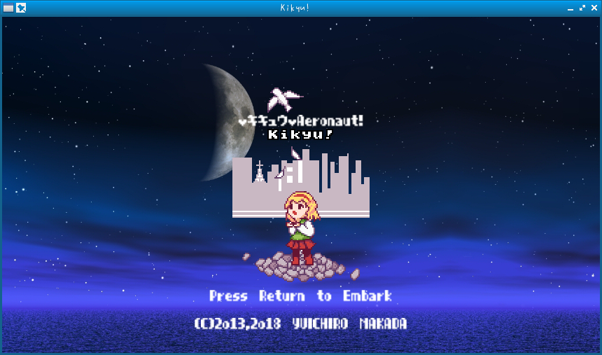
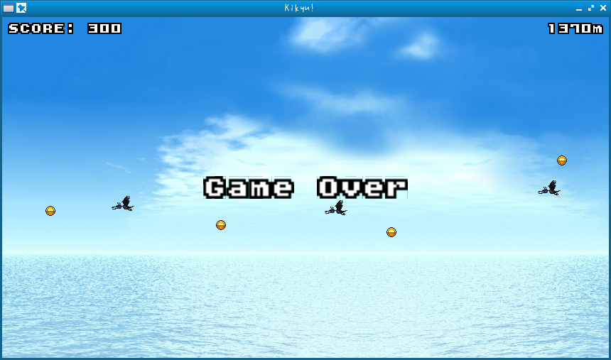

# Kikyu!

a game.





## How to use

```bash
$ clang -std=c11 -Os -ffunction-sections -fdata-sections -MMD -MP -Wall -Wextra -Winit-self -Wno-unused-parameter -Wno-float-equal -Wno-missing-braces -I../../ -I../../nanovg -o obj/main.o -c main.c
$ clang++ -o Kikyu! obj/main.o obj/../../nanovg/nanovg.o /usr/lib64/libglfw.so /usr/lib64/libGL.so -Wl,-s -Wl,--gc-sections
$ ./Kikyu\!
```

## Other versions

- https://github.com/yui0/Kikyu
- https://github.com/yui0/Kikyu-SoftPixel
